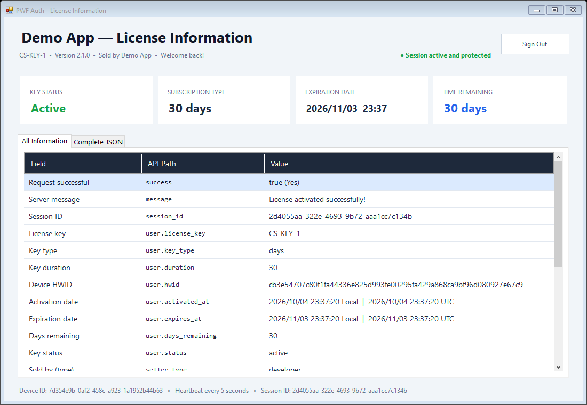
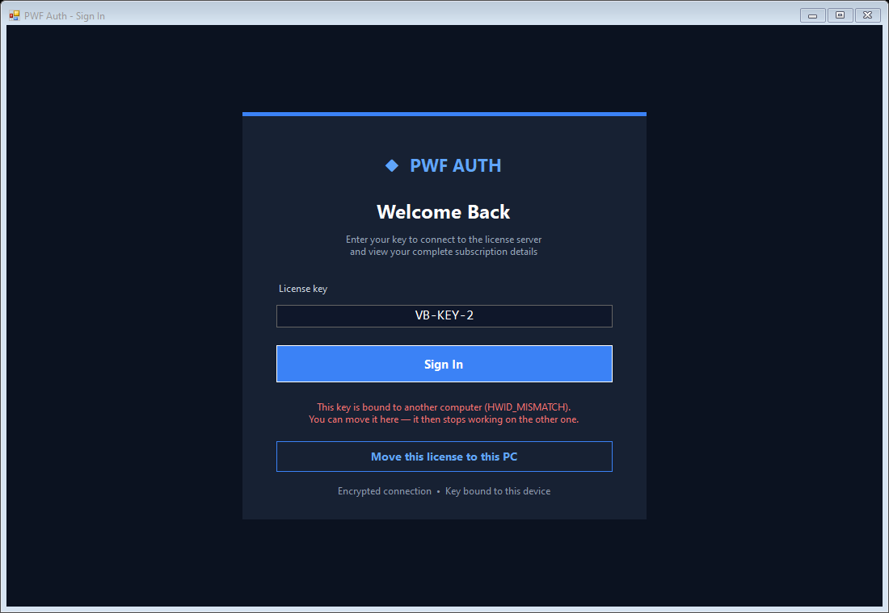

# PWF Auth C# Desktop Client

An English Windows Forms sample for the official
[`PWFAuth` NuGet package](https://www.nuget.org/packages/PWFAuth) (version 1.3.0)
on .NET Framework 4.8.1. The application:

- signs in with a license key;
- keeps the session alive with the background heartbeat;
- signs out when the server ends the session;
- shows the complete login response in a dashboard.



## What it shows

- **Sign in with a license key.** `LoginAsync` binds the key to this computer.
  The dashboard then shows:
  - the key's status, type, expiry and time left;
  - who sold the key;
  - every field of the reply.
- **The kill switch.** `StartHeartbeat` runs after sign-in. When you ban, pause or
  reset the key in your dashboard, or it expires, the package raises
  `SessionEnded`, and the app returns to the sign-in page with the reason. The
  event arrives on the UI thread, so no `Invoke` is needed.
- **Move a license to a new PC.** When the key is bound to another computer, the
  sign-in page offers **Move this license to this PC**. This uses
  `ResetHardwareIdAsync`, then signs in again. The developer's cooldown applies
  between two moves (12 hours by default).

  

- **Clear errors.** The app shows a plain message when:
  - there is no internet connection;
  - the server refuses the application secret (HTTP 401);
  - the secret in `App.config` is still the placeholder.
- **Clean sign-out.** **Sign Out** and closing the window both end the session on
  the server right away.

The package also repairs a wrong PC clock by itself. It refuses a reply that
claims success without encryption.

## Requirements

- Windows 10 or later
- Visual Studio with the .NET desktop development workload
- .NET Framework 4.8.1

## Configure

Set the 64-character application secret in
`PWFAuthCSharp/App.config`:

```xml
<add key="PWFAuthAppSecret" value="YOUR_64_CHARACTER_APP_SECRET" />
```

Alternatively, set the `PWFAUTH_APP_SECRET` environment variable. Never commit a
real application secret or license key to the repository.

Optional: to point the app at another server, such as a staging copy, set
`PWFAuthBaseUrl` in `App.config` or the `PWFAUTH_BASE_URL` environment
variable. When both are empty, the app uses `https://pwfauth.com`.

## Build and run

1. Open `PWFAuthCSharp.slnx` in Visual Studio.
2. Restore NuGet packages when prompted.
3. Select `Debug | Any CPU` and press `F5`.

Upgrading from an older copy of this sample? Restore the NuGet packages once, so
`PWFAuth` 1.3.0 replaces 1.0.1 in the `packages` folder.
